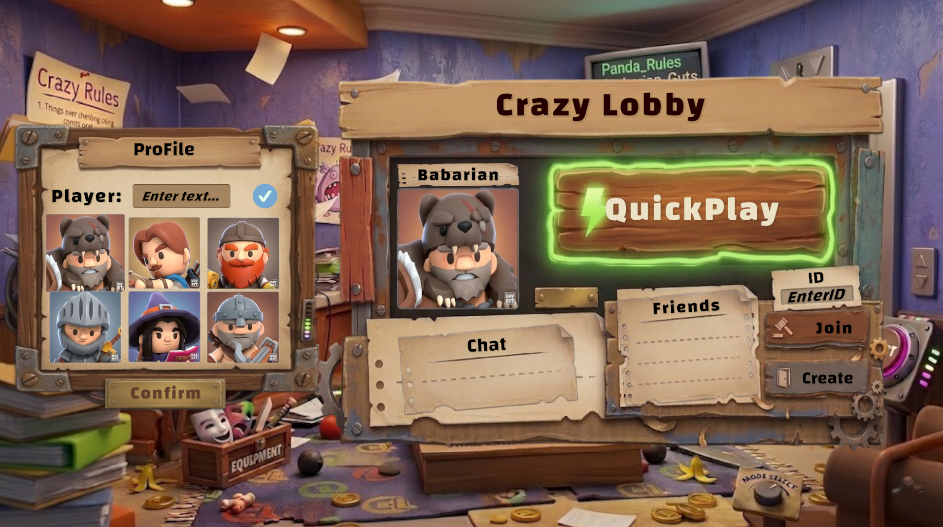

# Crazy Lobby

Crazy Lobby is a multiplayer party game inspired by chaotic obstacle-course gameplay where players compete to survive and reach the finish line.

## Overview

Crazy Lobby focuses on fast-paced, physics-based gameplay combined with a simple but functional lobby system. Players can quickly join matches, create rooms, and interact before entering the game.

## Features

* Lobby system with player profile and character selection
* Quick Play matchmaking
* Room system (Join / Create by ID)
* Real-time multiplayer gameplay
* Physics-based obstacles and interactive maps
* Basic chat system in lobby

## Gameplay

Players spawn into dynamic maps filled with traps, moving platforms, and hazards. The objective is to survive and reach the goal before other players.

## Lobby & UI

The lobby allows players to select characters, chat, and manage matchmaking before entering a game session.

## Tech Stack

* Unity (Client)
* C#
* ASP.NET Core Web API (Lobby, authentication, matchmaking)
* WebSocket (real-time gameplay synchronization)

## Project Structure

* Client: Unity project (UI, gameplay systems, animations)
* Server: Web API + WebSocket server
* Assets: Characters, UI elements, environment

## Status

Prototype / Demo with core systems implemented (lobby, basic gameplay, multiplayer sync)

## Team

Developed by a team of 3 members

## Notes

Replace all `YOUR_IMAGE_LINK_HERE` with your actual image URLs or local paths (e.g. `./images/gameplay.png`).
